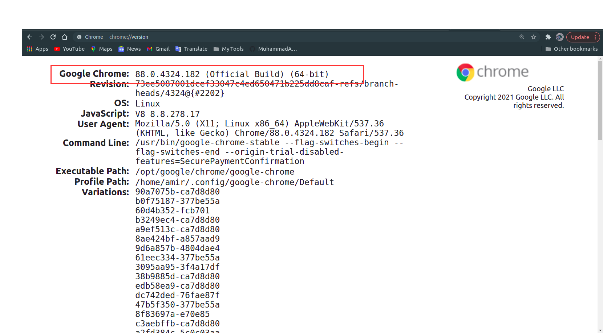
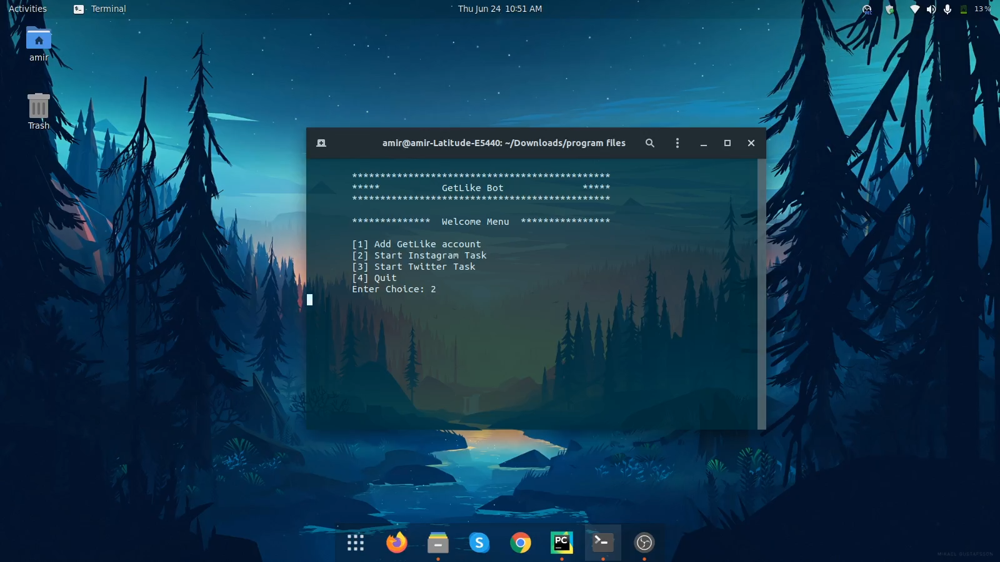

# GetLike Automation 

https://user-images.githubusercontent.com/62555280/123333058-b7103e00-d55a-11eb-8675-0f64d82aea32.mp4

> Scripts to automate the functionalities of GetLike Web App 

Getlike is an online platform for the Exchange of earnings and promotion on social media such as Instagram, TikTok, Vk, Telegram, Ok, Twitter, etc. it gives some task e.g. like a post, repost, subscribe to a user, comments on a, etc. complete those task to earn money. this is the demo of the script that automates these tasks.

### Features
- Handling async behavior of the site
- Accounts Login 
- Follow Instagram User
- Like Instagram Post

## How To Use

#### Installation
Download or Clone the project on your local machine.
```
$ git clone https://github.com/MuhammadAmir5670/GetLike-Automation.git
```
create an virtual enviroment and activate it. then`cd` into the project directory.
```
$ python -m venv env
$ source env/bin/activate
$ cd /home/username/PycharmProjects/FaceApp/model
```

*Notice:* If your pc don't have virtual enviroment or pip install the follow this link. [How to create Virtual Enviroment](https://packaging.python.org/guides/installing-using-pip-and-virtual-environments/ "How to create Virtual Enviroment")

#### Dependencies
- Selenium
- tabulate
- loguru

to install all dependencies

```
$ pip install -r requirements.txt
```

Now to control our browser we need a [Web Driver](https://www.google.com/search?q=what+is+chrome+webdriver&sxsrf=ALeKk00-Qds9WR-roLkT7WFzjx-hbzZ65g%3A1624567090776&ei=Mu3UYODoLs6jkwWf4bDgAQ&oq=what+is+chrome+webdriver&gs_lcp=Cgdnd3Mtd2l6EAMYADICCAAyBggAEAgQHjIGCAAQCBAeOgcIIxCwAxAnOgcIABBHELADOgcIABCwAxBDSgQIQRgAUOYwWM02YINBaABwAXgAgAGEA4gBxROSAQUyLTkuMZgBAKABAaoBB2d3cy13aXrIAQrAAQE&sclient=gws-wiz). WebDriver is an open source tool for automated testing of webapps across many browsers. As the scripts have been written for testing on chrome so we need to download [Chrome Web Driver](https://chromedriver.chromium.org/downloads) make sure to download the same version of web driver as of your browser. to check your browser version click [Here](chrome://version).




#### Usage

```
$ python main.py
```



## Error Analysis and Limitations
The possible reasons for the errors could be:

1. Automation involves switching between different windows opening and closing. the error occurs when the program detects more then one window at a time. this could be avoided by runing the browser with only one window (Tab) opened.
    
2. The Getlike.io Website extensively uses AJAX (async call to the server) the data changes without page reloading. the script handles this behavior very well but it is still very unpredictable.
3. some errors arise because of the slow internet connection if server resposnse time exceeds the async await time the program could crash if and only if the current loaded page crashes. 

## License


## Author Info
- Gmail [muhammadamir5670@gmail.com]()
<p align="left">
<a href = "https://www.linkedin.com/in/muhammad-amir-9826b71b5/"></a>
<a href = "https://twitter.com/Daniyal60990408/"></a>
<a href="https://www.facebook.com/daniyal.abbasi.1610/">

</a>
<a href = "https://www.instagram.com/the_infamous_abbasi/"></a>
</p>

